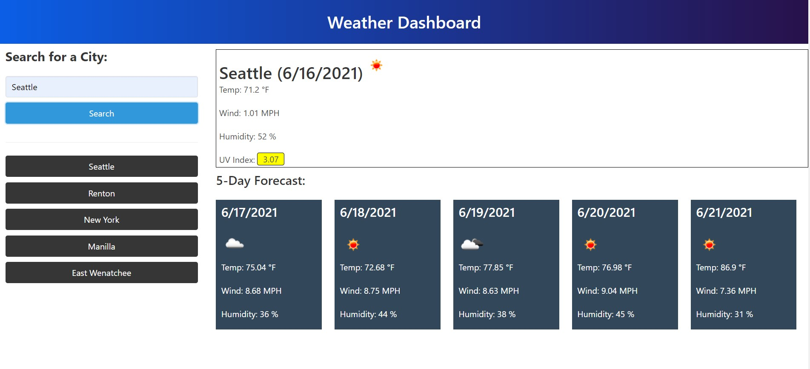

# Weather Dashboard

Deployed application: https://adriancronin.github.io/WeatherDashboard/

## Description
Search for a city and see its current weather and its 5-Day weather forecast.

* The motivation for this project was to build an app that could take user input and make API calls based on that input, then display the retrieved information in a way that is easily understandable to the user.

* I built this so a user can look up a city and quickly see the current and upcoming weather then be able to plan/dress accordingly.

* I learned how to manipulate fetch request url's to make requests with specific parameters. I also learned how to parse the information retrieved so that I only use the specific pieces I want. I now know about asynchronous functions and that I have to wait for the Promise to resolve before executing functions that reference data retrieved.

## Usage

Type in a city in the Search Bar and click the Search button to view the city's current weather and its 5-Day weather forecast. Previous searches are saved below the Search Bar as buttons, press a button to see that city's weather.

Screenshot of deployed application:

 

